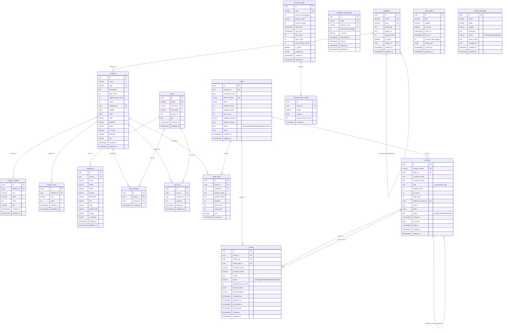

# Diagrama Entidad-Relación (ER) - FashionMarket

## Diagrama ER completo



---

## Descripción de relaciones principales

### Catálogo
- **categories** → **products**: Cada producto pertenece a una categoría (1:N). Las categorías pueden ser jerárquicas (self-reference con `parent_id`).
- **products** → **product_sizes**: Stock gestionado por talla con stored procedures atómicas (`decrement_stock`, `increment_stock`).
- **products** → **product_variants**: Variantes de producto por talla+color.

### Usuarios
- **auth.users** → **users**: Relación 1:1 con la tabla de autenticación de Supabase.
- **users** → **addresses**: Un usuario puede tener múltiples direcciones.
- **users** → **user_favorites** / **user_cart**: Favoritos y carrito persistente.

### Pedidos (Flujo de 4 estados)
```
Pendiente (pending) → Pagado (paid) → Enviado (shipped) → Entregado (delivered)
                ↓                ↓
           Cancelado         Cancelado
```
- **orders** → **order_items**: Cada pedido contiene N artículos.
- Al crear un pedido (`checkout.ts`), el status inicial es `pending`.
- El admin puede avanzar/retroceder estados desde el panel.
- Cancelación permitida solo en estados `pending` y `paid`.
- Devolución permitida solo en estado `delivered`.

### Facturación y Devoluciones
- **orders** → **invoices**: Cada pedido puede tener facturas asociadas.
- **invoices** → **invoices** (self-ref): Un abono (`credit_note`) referencia la factura original.
- **orders** → **refunds**: Las devoluciones se asocian al pedido.
- **refunds** → **invoices**: La devolución vincula la factura original y la nota de abono.

### Marketing
- **newsletter_subscribers**: Gestión de suscriptores con códigos de descuento automáticos.
- **discount_codes** → **discount_code_usage**: Tracking de uso de códigos.
- **flash_offers**: Ofertas flash con countdown, gestión desde admin.

---

## Flujo de facturación / billing

### 1. Creación del pedido
1. Cliente completa checkout → se crea `order` con status `pending`
2. Stock decrementado atómicamente via stored procedure `process_checkout_stock`
3. Se genera `invoice` de tipo `invoice` con status `issued`

### 2. Procesamiento del pago
1. Stripe procesa el pago mediante checkout session
2. El admin marca el pedido como `paid` → se envía email de confirmación
3. La factura se actualiza a status `paid`

### 3. Envío y entrega
1. Admin marca como `shipped` → email con notificación al cliente
2. Admin marca como `delivered` → email de confirmación de entrega

### 4. Devoluciones
1. Cliente solicita devolución (solo si `delivered`) desde `/account#orders`
2. Se crea registro `refund` con status `pending` y `returned_items`
3. Se genera `invoice` de tipo `credit_note` referenciando la factura original
4. Se restaura el stock via `increment_stock` stored procedure
5. Admin aprueba/procesa la devolución → status cambia a `processed`

### 5. Cancelaciones
1. Cliente puede cancelar desde su cuenta (solo si `pending` o `paid`)
2. Se restaura stock automáticamente
3. El pedido cambia a status `cancelled`
